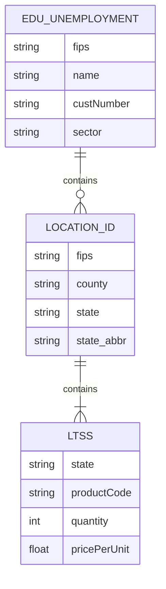

## Capstone II Data Model 

## Identify common/key values and naming conventions

- fips
- county
- state
- state abbr

### education (subset rows)

- 'Less than high school graduate, 2019-23', 'High school graduate (or equivalency), 2019-23', 'Some college or associate degree, 2019-23', 'Bachelor's degree or higher, 2019-23'

- **col names to change:** 'FIPS Code': 'fips', 'Area Name':'county', 'State':'state', 'Less than high school graduate, 2019-23': 'no_hs_diploma', 'High school graduate (or equivalency):'hs_diploma', 2019-23', 'Some college or associate degree, 2019-23': 'some_college', 'Bachelor's degree or higher, 2019-23': 'bachelors_or_more'

### unemployment (subset rows)
- Civilian_labor_force_2022, Employed_2022, Unemployed_2022

-  col names to change: {'FIPS_Code':'fips', 'Area_Name':'county', 'State':'state', 'Civilian_labor_force_2022':'labor_force', 'Employed_2022':'employed', 'Unemployed_2022':'unemployed'}

### quality_of_life (subset columns)

- NMCNTY, FIPS, LSTATE, 2022 Population, 2020PopulrVoteParty, Cost of Living, 2022 Median Income, Diversity Rank (Race), Diversity Rank (Gender)

- **col names to change**: 'NMCNTY': 'county', 'FIPS: fips', 'LSTATE': 'state_abbr', '2022 Population': 'population', '2020PopulrVoteParty': 'popular_vote_party', 'Cost of Living: cost_of_living', '2022 Median Income: median_income', 'Diversity Rank (Race)': 'race_diversity_rank', 'Diversity Rank (Gender)': 'gender_diversity_rank'

### ltss_2022(state-level)-  (subset columns)

- State, LTSS (total), Institutional (total), HCBS (total), Both HCBS and Institutional (total)

- **col names to change:** 'State': 'state', 'LTSS (total)': 'ltss_total_enrollment', 'Institutional (total)': 'insitutional_enrollment', 'HCBS (total)': 'hcbs_enrollment'

### ltss_expenses(state-level)- **rename 'totals' to 'total expenses'**- (subset columns)

- State, LTSS (total), Institutional (total), HCBS (total), Both HCBS and Institutional (total)

- col names to change: 'State':'state', 'LTSS (total)': 'ltss_total_expense', 'Institutional (total)': 'insitutional_expense', 'HCBS (total)': 'hcbs_expense'

## Issues

- education and unemployment subsets willl include states and us values, subset by str including 'county' will exclude '

census area', 'muncipality', etc

- left join w qol, since only counties included

# Functions

## Row Subsets

- select rows containing: [list of values]
- rename cols: [dict]
- pivot
- change datatypes

## Col subsets
- select columns:  [list of values]
- rename cols: [dict]
- change dtypes
## Data Model/Merge Tables
### Merge like tables
- ltss_2022 and ltss expenses = 'ltss'
- education and unemployment= 'education_and_unemployment'
### create central table w key id's
- fips
- county
- state
- state abbr
1. Merge 'education_and_unemployment' & 'us_states' on ==state==